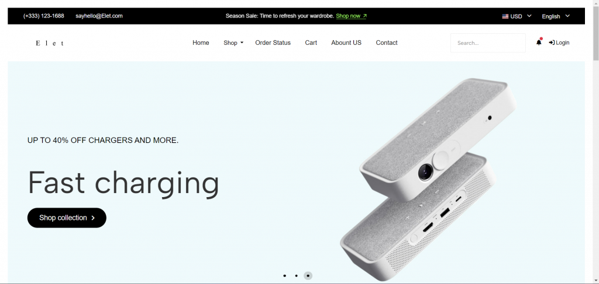
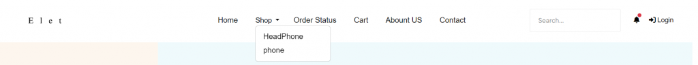
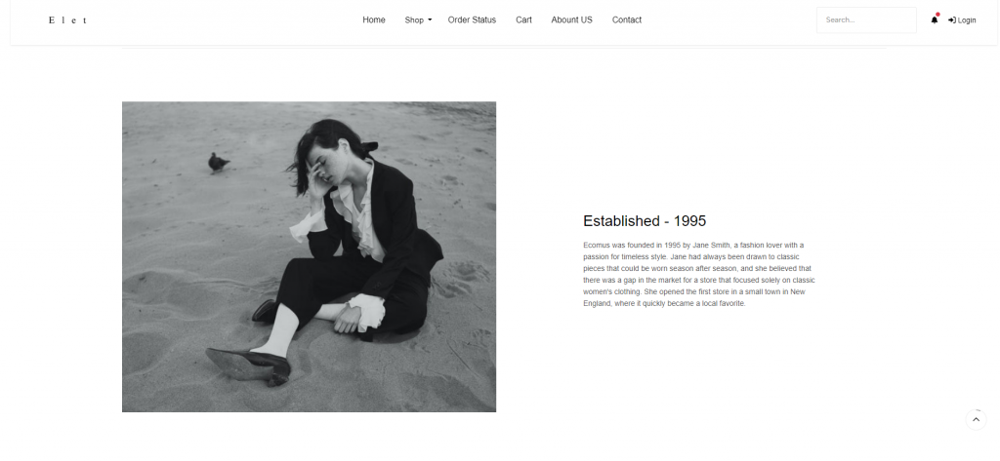
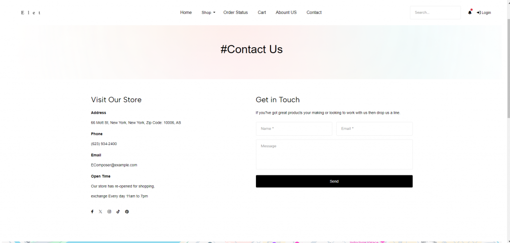
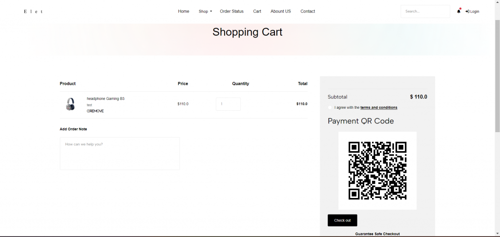
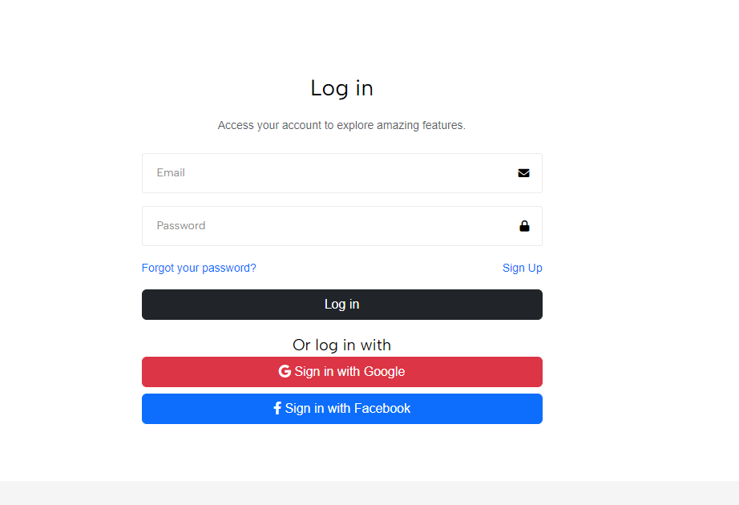
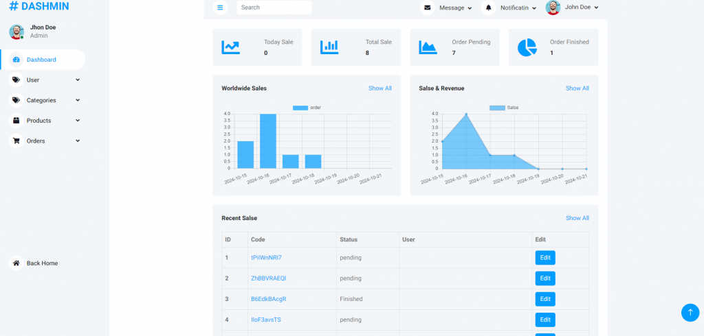

#### Trần Hữu Thái
 ### Java Web - Thiết kế website Elet
 # Giới thiệu
 - Trang web Elet chính là một website bán hàng với sản phẩm chủ yếu là đồ công nghệ.
 - Trang web được xây dưng dựa trên các nền tảng: HTML, CSS, Java, Javascript, MySQL.
# Dưới đây là những hình ảnh chi tiết về website này
- Home page

- Category page

- Shop page

- Detail page

- About page

- Contact page

- Cart page

- Login page

- Register page

- Dashboard admin page

